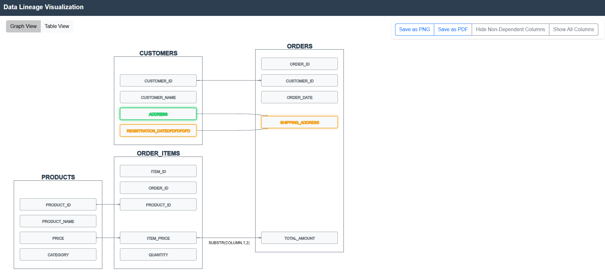

# Data Lineage
This project provides a web-based data lineage visualization tool using Flask, D3, and several JavaScript libraries. The application renders a graph view and table view of data lineage information.

# Sample screenshots




## Project Structure

```
/home/vijay/repo/
├── README.md              # This documentation file
├── lineage.py             # Flask application initializing sample data and endpoints
├── llmchat/
│   ├── templates/
│   │   └── lineage.html   # HTML template rendering the visualization UI
│   └── static/
│       ├── css/
│       │   └── lineage.css  # Custom styles for the visualization and layout
│       └── js/
│           ├── lineage.js     # Main JS file (ES6 module) initializing components
│           └── modules/       # ES6 modules for each functionality:
│               ├── graph.js         # Graph rendering using D3 and dagre-d3
│               ├── events.js        # Event handling (tooltips, node click)
│               ├── download.js      # Functions for exporting diagram and table
│               └── table.js         # Table initialization and view toggling
```

## Technologies

- Python & Flask for the backend.
- HTML, CSS (Bootstrap), and JavaScript (ES6 modules) for the frontend.
- D3.js and dagre-d3 for diagram rendering.
- Bootstrap Table for table view and interactivity.
- Additional libraries:
  - jspdf (for PDF exports)
  - xlsx (for Excel exports)
  - jQuery

## Setup & Run

1. Ensure Python and required libraries are installed.
2. Install Flask:
   ```
   pip install flask
   ```
3. Run the Flask application from the project root:
   ```
   python lineage.py
   ```
4. Open your web browser and navigate to `http://localhost:5001` to view the visualization.

## Usage

- **Graph View:** Displays the interactive lineage diagram.
- **Table View:** Click the "Table View" button to switch to a table layout showing lineage details.
- **Export Options:** 
  - Download the diagram as PNG, PDF, or SVG.
  - Export table data to Excel.
- **Column Toggling:** Use "Hide Non-Dependent Columns" (filters out unused columns) or "Show All Columns" to display all.

## Customization

- Modify the sample data in `lineage.py` to suit your lineage information.
- Update styles in `static/css/lineage.css` as needed.
- Extend functionality by editing respective modules in `static/js/modules/`.

## Notes

- The project uses ES6 modules. Ensure that the script tag in the HTML template includes `type="module"`.
- Global functions are exposed in `static/js/lineage.js` to support inline event handlers in the HTML template.

## Troubleshooting

- If you see errors related to modules, verify that your browser supports ES6 modules.
- For any missing functionality or issues with exports, check the module files in `static/js/modules/`.